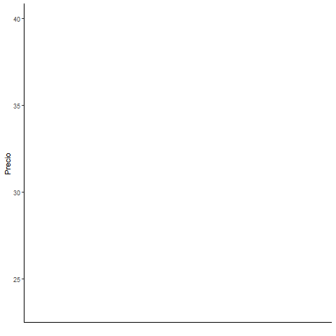
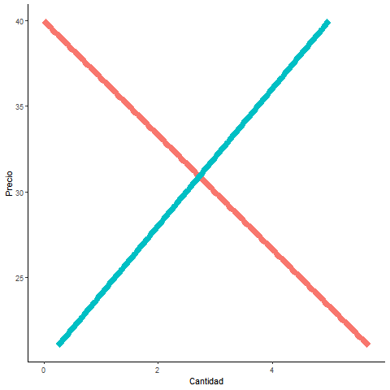

# Modelo de la Telaraña 🕸️
## Exposición para "Calculo III 2019" materia de la Licenciatura en Estadística (UdelaR) 

El modelo de la Telaraña es un modelo general que explica la formación de precios con curvas de oferta y demanda establecidas en periodos de tiempo diferentes.
Se utilizo como parte de una aplicación a la economia al tema de Ecuaciones en diferencia. 

En el repositorio se encuentra la programación en R con simulaciones de casos y su animación utilizando gganimate y ggplot2. Además, se encuentra la presentación utilizada en la exposición.

El trabajo fue realizado en conjunto con Fabricio Machado.

<table>
<tbody>
<tr>
<td>

</td>
<td>

</td>
</tr>
</tbody>
</table>
