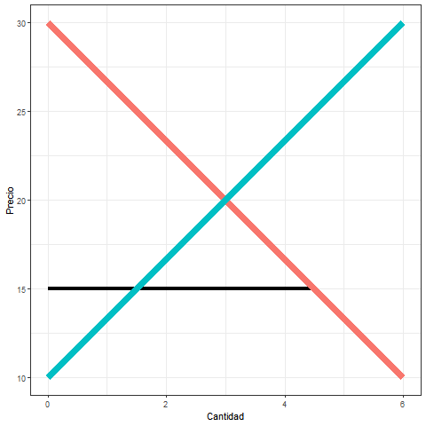
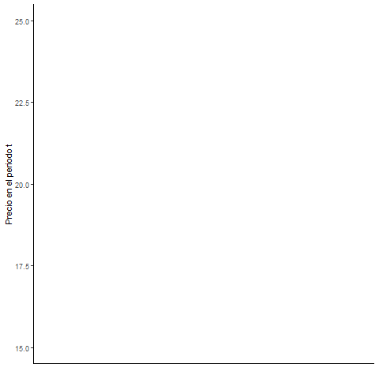
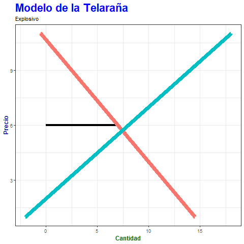
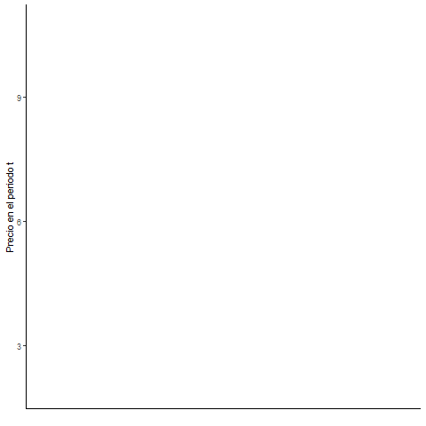

# Modelo de la Telaraña 🕸️ : 
## Exposición para "Cálculo III 2019"

El modelo de la Telaraña es un modelo general que explica la formación de precios con curvas de oferta y demanda establecidas en periodos de tiempo diferentes.
Se utilizo como parte de una aplicación a la economia al tema de *Ecuaciones en diferencia*. 

### Oscilación Amortiguada:
#### La pendiente de la curva de demanda es mayor que la de la oferta. 

<table>
<tbody>
<tr>
<td>

</td>
<td>

</td>
</tr>
</tbody>
</table>

### Oscilación Uniforme:
#### La pendiente de la curva de demanda es igual a la de la oferta. 

<table>
<tbody>
<tr>
<td>

</td>
<td>

</td>
</tr>
</tbody>
</table>

### Oscilación Explosiva:
#### La pendiente de la curva de demanda es menor a la de la oferta. 

<table>
<tbody>
<tr>
<td>

</td>
<td>

</td>
</tr>
</tbody>
</table>

En el repositorio se encuentra la programación en R con simulaciones de casos y su animación utilizando gganimate y ggplot2. Además, se encuentra la presentación utilizada en la exposición.

El trabajo fue realizado en conjunto con Fabricio Machado.

Prueba
